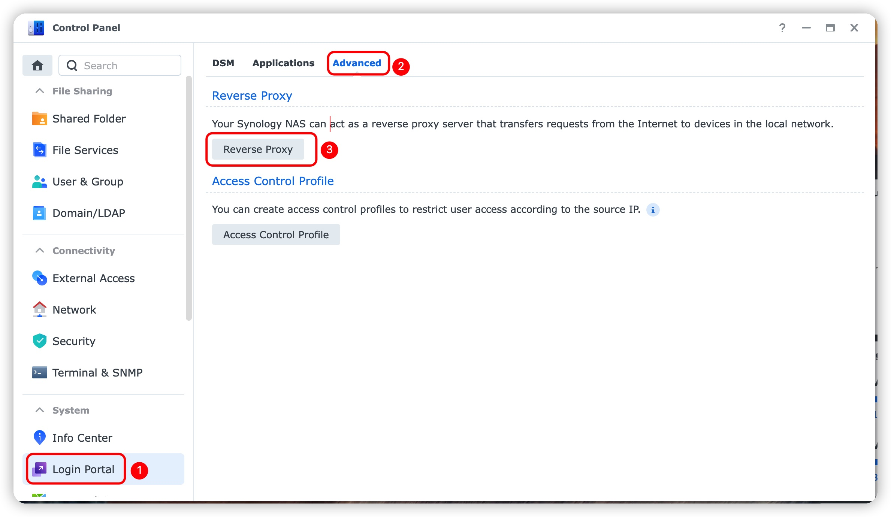

## DSM7 Custom DDNS

This is a docker image for DSM 7.x to using custom DDNS provider
such as CloudFlare, etc.

## Requirement
A valid ssl certificate and has been setting up on your DSM.

## Description

Using this project to create a custom DDNS on DSM 7.x in minutes!

## Usage

```shell
docker run -d -p 8000:80 chowrex/dsm7-ddns:latest
```

~~When you're done, you can use 
`http://IP:8000/update?record=__HOSTNAME__&value=__MYIP__&password=__PASSWORD__`
as your DSM DDNS provider's query URL.~~

2022-06-25 Update: 
Synology official DDNS method ***Required*** `https` type protocol
to modified record, if using `http` protocol, it will return an error,
such as *Please contact your DSM administrator to fix it.* or something like this.
Thus, **Must** set DSM https reverse proxy for your service, if you didn't have any
valid https certificate, please obtain one first.

1. Goto `Login Protal` -> `Advanced` -> `Reverse Proxy`

2. At the `Reverse Proxy List` page, click `Create` button.

3. Fill the form as pic shows, then click `Save` button.

4. Goto `Exeternal Access` -> `DDNS` -> `Customize Provider`

5. Fill the form as pic shows, then click `Save` button.
`Query URL` is here
    ```shell
    https://ddns.example.com/update?record=__HOSTNAME__&value=__MYIP__&username=__USERNAME__&password=__PASSWORD__
    ```
    
6. Click `Add` button to add a record.

7. Fill the form as pic shows, then click `OK` button.

8. Done!

For more details, read:

> ENG: [DDNS | DSM - Synology Knowledge Center](https://kb.synology.com/en-us/DSM/help/DSM/AdminCenter/connection_ddns?version=7)

> CHS: [DDNS | DSM - Synology 知识中心](https://kb.synology.cn/zh-cn/DSM/help/DSM/AdminCenter/connection_ddns?version=7)
